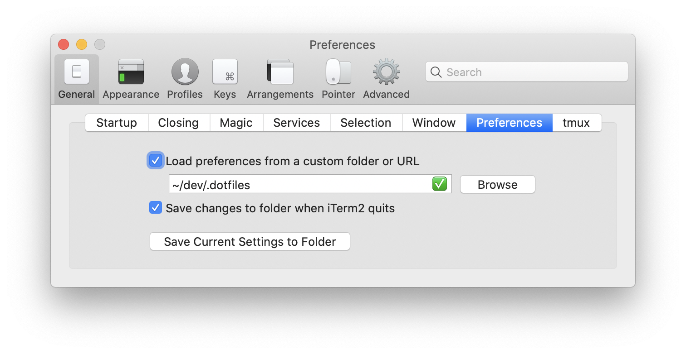

# .dotfiles - and some other useful config files

This repository contains some common dotfiles I am using for my local dev environment.

## Dotfiles - content

### `.editorconfig`

A basic `.editorconfig` with some common settings.

### `.gitconfig`

Basic git configuration file and some shortcuts

### .profile

Some common `$PATH` and other environment variable exports.

### .vimrc

A customized vim configuration using [_Vundle_](https://github.com/VundleVim/Vundle.vim) Plugin Manager.

1. Istall Vundle:

```bash
git clone https://github.com/VundleVim/Vundle.vim.git ~/.vim/bundle/Vundle.vim
```

1. Install and activate the Plugins by opening `vim` and typing the following command:

```vim
:PluginInstall
```

### .zprofile

includes `.profile` dotfile for usage within zsh.

### .zshrc

A basic zsh configuration using [_oh-my-zsh_](https://github.com/robbyrussell/oh-my-zsh).
In this config some basic aliasses and functions are already configured.

## Other configuration files

### `osx.sh`

Some settings for macOS, for configuring finder, desktop, enabling debug options, display options (hidden files, file extensions, etc.).
The file needs to be executed from the command line:

```sh
sudo chmod +x osx.sh
sudo sh osx.sh
```

> :warning: Keep in mind that this will be override some default settings of your mac and activate / deactivete features which are hidden in the macOS preferences and can only be set by using the command line. Check carefully all the settings in the script and adjust / uncomment them before running the script.

### com.googlecode.iterm2.plist

An iTerm2 configuration file which can be used by configuring it in the preferences.



### Brewfile

A `Brewfile` contains the installed package configuration for [_Homebrew_](https://brew.sh/index_de).
You can simply install the packages from the file by running `brew bundle` if you are in the
current directory or by using the path to the file:
`brew bundle ${HOME}/dev/.dotfiles/Brewfile`.
It will install the packages from `brew`, `cask` and `mas`.

Creating a new file can be achieved by exporting it e.g. via [_Cakebrew_](https://www.cakebrew.com/):

- Tools
- Export Brew Installation

## Fresh macOS setup

When setting up your mac completely new, I recommend the following steps:

- proceed the macOS configuration (`sudo sh osh.sh`).
- Install [Homebrew](https://brew.sh/index_de)
- Install Homebrew packages via `Brewfile` (`brew bundle`).
- Link your dotfiles (`ln -sf ${HOME}/dev/.dotfiles/<DOTFILE> ${HOME}/<DOTFILE>`) or copy them (`cp ${HOME}/dev/.dotfiles/<DOTFILE> ${HOME}/<DOTFILE>`)
- Install [iTerm2](https://www.iterm2.com)
- Import / link iTerm2 configuration (Preferences -> Gerneral -> Preferences -> Load preferences from a custom URL or folder)


### macOS TimeMachine

Defines a list of directories (e.g. all `node_modules` directories inside the `~/dev`) that should be excluded from time machine backup (as they are quite big and can be re-installed by `npm i` after restoring a backup).
To proceed, simply run `sh time-machine-excludes.sh`.
