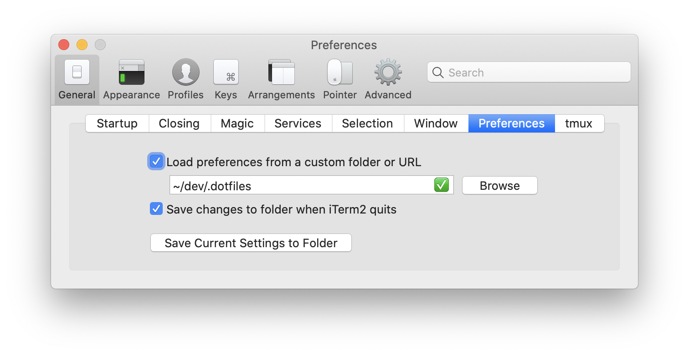

# .dotfiles — and some other useful config files

This repository contains common dotfiles and configuration for my local macOS dev environment.

## Dotfiles

### `.editorconfig`

A basic `.editorconfig` with common settings (spaces, indent size 2, UTF-8, LF line endings).

### `.gitconfig`

Git configuration with color settings, useful aliases (`a`, `ca`, `cam`, `s`, `cob`, `ci`, …), URL shorthands for GitHub/Gist, pull rebase by default, and LFS filter setup.

### `.gitmessage`

A commit message template following the [Angular Commit Message Format](https://github.com/angular/angular/blob/main/CONTRIBUTING.md#commit) with examples for features, bug fixes, docs changes, and breaking changes.

### `.gitignore`

Global gitignore for `.DS_Store`, `.bash_history`, temporary files, and machine-specific local configs.

### `.profile`

Environment variable exports for SSH, Homebrew, Android SDK, Go, Flutter, Rust (cargo), Graphviz, SonarQube, and RabbitMQ.

### `.vimrc`

A customized vim configuration using [Vundle](https://github.com/VundleVim/Vundle.vim) Plugin Manager with the Nord color scheme, airline, emmet, Go support, TypeScript support, and various quality-of-life settings.

1. Install Vundle:

```bash
git clone https://github.com/VundleVim/Vundle.vim.git ~/.vim/bundle/Vundle.vim
```

2. Install and activate the plugins by opening `vim` and running:

```vim
:PluginInstall
```

### `.zprofile`

Sets up oh-my-zsh and includes the `.profile` dotfile for zsh usage.

### `.zshrc`

A zsh configuration using [oh-my-zsh](https://github.com/ohmyzsh/ohmyzsh) with the `muse` theme.

Highlights:

- **Plugins:** git, brew, iterm2, npm, golang, zsh-autosuggestions, nx-completion
- **Node version management:** [fnm](https://github.com/Schniz/fnm) (fast node manager) with corepack support and `nvm` alias
- **Java version management:** [SDKMAN](https://sdkman.io/)
- **Ruby:** chruby with auto-switching
- **Package managers:** pnpm, bun
- **Editor:** Kiro (`code` is aliased to `kiro`)
- **GPG signing** for git commits and sops
- **Telemetry disabled** for CDK and Storybook
- **Useful aliases:** `ll`, `dev`, `play`, `killport`, `new-password`, `jdk`, etc.
- **Functions:** `mkd`, `targz`, `fs`, `digga`, `getcertnames`, `tre`, `killport`, and more

### `.zshrc.local`

Machine-specific zsh overrides (gitignored). Automatically sourced by `.zshrc` when present.

## Other configuration files

### `osx.sh`

macOS system preferences configuration — Finder, Dock, Trackpad, Safari, Terminal, Time Machine, hot corners, and more. Execute with:

```sh
sudo sh osx.sh
```

> ⚠️ This will override some default macOS settings and activate/deactivate features that are hidden in the macOS preferences. Check carefully all settings in the script and adjust them before running.

### `setup-dotfiles.sh`

Copies `.gitconfig`, prompts for git user name/email, symlinks dotfiles to `$HOME`, clones zsh-autosuggestions, and runs `setup-dotfiles.local.sh` if present. Also symlinks AWS/Azure CLI tools from Homebrew to `/usr/local/bin/` for Leapp compatibility.

### `setup-dotfiles.local.sh`

Machine-specific setup steps (gitignored). Automatically executed by `setup-dotfiles.sh` when present.

### `setup-go.sh`

Installs Go via Homebrew and creates the Go workspace directories (`$HOME/dev/go/{bin,src,pkg}`).

### `extensions.sh`

Installs a curated list of VS Code / Kiro extensions via CLI (`code --install-extension ...`).

### `settings.json`

VS Code / Kiro user settings including editor preferences, font (Hack Nerd Font), ruler columns, spell checker languages (en/de), terminal configuration, and extension-specific settings.

### `com.googlecode.iterm2.plist`

An iTerm2 configuration file. Load it in iTerm2 preferences:

> Preferences → General → Preferences → Load preferences from a custom URL or folder



### `Brewfile`

A `Brewfile` for [Homebrew](https://brew.sh/) containing `brew`, `cask`, and `mas` packages.

Install all packages:

```bash
brew bundle
```

Export current installation:

```bash
brew bundle dump -f ${HOME}/dev/.dotfiles/Brewfile
```

### `time-machine-excludes.sh`

Excludes all `node_modules` directories inside `~/dev` from Time Machine backups.

To run regularly, add a cronjob:

```bash
crontab -e
```

```bash
0 12 * * *  cd $HOME/dev/.dotfiles && ./time-machine-excludes.sh # every day at 12:00
```

### `java.md`

Instructions for setting up the Java environment using SDKMAN and Maven. See [java.md](./java.md).

### `local/`

Directory for machine-specific config files/templates that should not be committed (gitignored).

## Fresh macOS setup

When setting up a new Mac:

1. Run the macOS configuration: `sudo sh osx.sh`
2. Install [Homebrew](https://brew.sh/)
3. Install Homebrew packages: `brew bundle`
4. Link dotfiles: `sh setup-dotfiles.sh`
5. Import/link iTerm2 configuration (Preferences → General → Preferences → Load preferences from a custom URL or folder)
6. Install VS Code / Kiro extensions: `sh extensions.sh`
7. Set up Go: `sh setup-go.sh`
8. Set up Java as described in [java.md](./java.md)

## Local mods

The following files/directories are `.gitignore`'d:

- **`.zshrc.local`** — machine-specific zsh modifications, automatically loaded by `.zshrc`
- **`setup-dotfiles.local.sh`** — machine-specific setup steps, executed by `setup-dotfiles.sh`
- **`local/`** — any other config files/templates you don't want to commit
